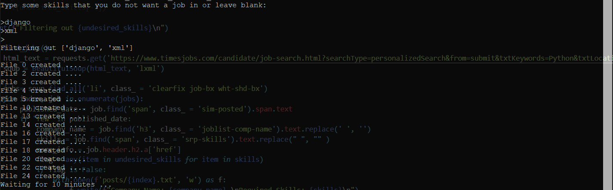
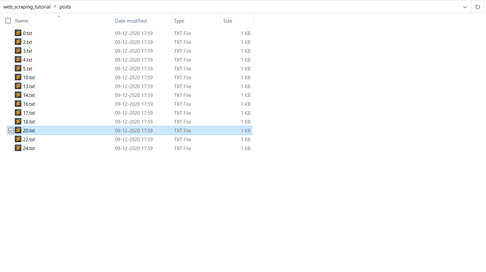

# web-scraping-proj-python-jobs
A small experimental web scraper that scrapes recent job posting resulting from searching *Python* on _https://www.timesjobs.com/_ and saves the results into text files. Runs every 10 minutes.

## Screen Grabs of the script in action:

 
**Result shown in terminal**
 
 
 

 
**Saved Results**
